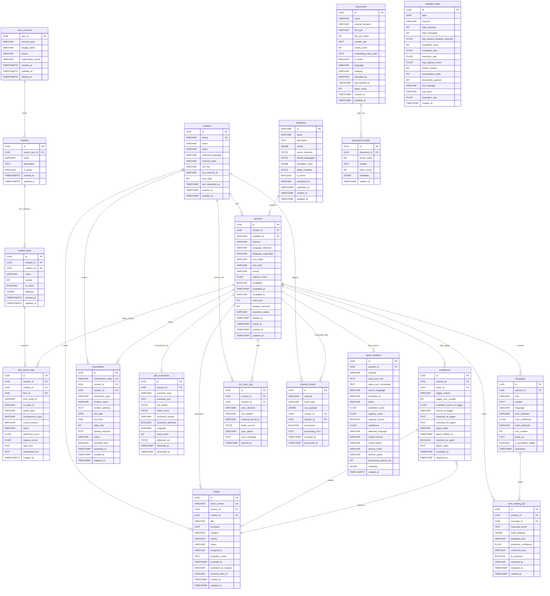

### SQL migration for query analytics

```sql
create table if not exists public.query_analytics (
  id uuid primary key default gen_random_uuid(),
  session_id uuid null references public.sessions(id) on delete set null,
  channel varchar(32) not null,
  query_text_raw text not null,
  query_text_normalized text not null,
  source_language varchar(16) null,
  translated_to varchar(16) not null default 'en',
  intent varchar(32) not null,
  sentiment_score double precision not null check (sentiment_score >= -1 and sentiment_score <= 1),
  urgency_score double precision not null check (urgency_score >= 0 and urgency_score <= 1),
  requires_human boolean not null default false,
  confidence double precision not null check (confidence >= 0 and confidence <= 1),
  detected_language varchar(16) not null,
  routed_service varchar(64) not null,
  routed_action varchar(64) not null,
  service_mode varchar(16) not null,
  service_status varchar(16) not null,
  processing_latency_ms integer not null check (processing_latency_ms >= 0),
  metadata jsonb not null default '{}'::jsonb,
  created_at timestamptz not null default now()
);

create index if not exists idx_query_analytics_created_at on public.query_analytics(created_at desc);
create index if not exists idx_query_analytics_intent on public.query_analytics(intent);
create index if not exists idx_query_analytics_session_id on public.query_analytics(session_id);
create index if not exists idx_query_analytics_channel on public.query_analytics(channel);
```

### SQL migration for account, chatbot, flowchart and action logs

```sql
create table if not exists public.user_accounts (
  user_id uuid primary key,
  account_type varchar(20) not null check (account_type in ('organization', 'user')),
  display_name varchar(120) null,
  phone varchar(32) null,
  organization_name varchar(180) null,
  created_at timestamptz not null default now(),
  updated_at timestamptz not null default now(),
  deleted_at timestamptz null
);

create table if not exists public.chatbots (
  id uuid primary key default gen_random_uuid(),
  owner_user_id uuid not null references public.user_accounts(user_id) on delete cascade,
  name varchar(120) not null,
  description text null,
  is_active boolean not null default true,
  created_at timestamptz not null default now(),
  updated_at timestamptz not null default now()
);

create table if not exists public.chatbot_flows (
  id uuid primary key default gen_random_uuid(),
  chatbot_id uuid not null references public.chatbots(id) on delete cascade,
  created_by uuid not null references public.user_accounts(user_id) on delete cascade,
  name varchar(120) not null,
  version integer not null,
  is_active boolean not null default true,
  definition jsonb not null,
  created_at timestamptz not null default now(),
  updated_at timestamptz not null default now()
);

create unique index if not exists uq_chatbot_flows_version on public.chatbot_flows(chatbot_id, version);

create table if not exists public.flow_action_logs (
  id uuid primary key default gen_random_uuid(),
  session_id uuid null references public.sessions(id) on delete set null,
  chatbot_id uuid not null references public.chatbots(id) on delete cascade,
  flow_id uuid not null references public.chatbot_flows(id) on delete cascade,
  from_node_id varchar(120) null,
  to_node_id varchar(120) null,
  action_type varchar(64) not null,
  consequence_type varchar(64) not null,
  routed_service varchar(64) not null,
  intent varchar(32) not null,
  sentiment_score double precision not null check (sentiment_score >= -1 and sentiment_score <= 1),
  urgency_score double precision not null check (urgency_score >= 0 and urgency_score <= 1),
  input_text text not null,
  normalized_text text not null,
  created_at timestamptz not null default now()
);

create index if not exists idx_chatbots_owner on public.chatbots(owner_user_id);
create index if not exists idx_chatbot_flows_chatbot on public.chatbot_flows(chatbot_id, version desc);
create index if not exists idx_flow_action_logs_flow on public.flow_action_logs(flow_id, created_at desc);
create index if not exists idx_flow_action_logs_session on public.flow_action_logs(session_id, created_at desc);
```

## MongoDB migration (current implementation)

The backend is now written around Mongo-style collections and document IDs.  
Collections to create in database `vaniflow`:

1. `users`
2. `user_accounts`
3. `chatbots`
4. `chatbot_flows`
5. `query_analytics`
6. `flow_action_logs`

Recommended document shapes:

```json
{
  "users": {
    "_id": "uuid-string",
    "email": "user@example.com",
    "password_hash": "salt:hash",
    "role": "organization|user",
    "display_name": "Name",
    "organization_name": "Acme Inc",
    "created_at": "ISODate",
    "updated_at": "ISODate"
  },
  "chatbot_flows": {
    "_id": "uuid-string",
    "chatbot_id": "chatbot-id",
    "created_by": "user-id",
    "name": "Support Flow v1",
    "version": 1,
    "is_active": true,
    "definition": {
      "start_node_id": "node_start",
      "nodes": [
        {
          "id": "node_start",
          "action": {
            "type": "reply|create_ticket|escalate_human|call_microservice|end",
            "payload": {}
          },
          "consequences": [
            { "condition": "urgency_score > 0.8", "next_node_id": "node_escalate" }
          ]
        }
      ]
    }
  }
}
```

Recommended indexes:

```javascript
db.users.createIndex({ email: 1 }, { unique: true });
db.user_accounts.createIndex({ user_id: 1 }, { unique: true });
db.chatbots.createIndex({ owner_user_id: 1, created_at: -1 });
db.chatbot_flows.createIndex({ chatbot_id: 1, version: -1 });
db.query_analytics.createIndex({ created_at: -1 });
db.query_analytics.createIndex({ intent: 1, channel: 1 });
db.flow_action_logs.createIndex({ flow_id: 1, created_at: -1 });
db.flow_action_logs.createIndex({ session_id: 1, created_at: -1 });
```

If using MongoDB Atlas Data API, configure:

- `MONGODB_DATA_API_URL`
- `MONGODB_DATA_API_KEY`
- `MONGODB_DATA_SOURCE`
- `MONGODB_DB_NAME`
