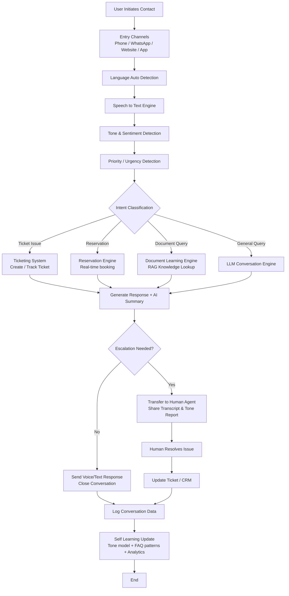

```mermaid
flowchart TD

A[User Initiates Contact] --> B[Entry Channels<br>Phone / WhatsApp / Website / App]

B --> C[Language Auto Detection]
C --> D[Speech to Text Engine]

D --> E[Tone & Sentiment Detection]
E --> F[Priority / Urgency Detection]

F --> G{Intent Classification}

G -->|Ticket Issue| H[Ticketing System<br>Create / Track Ticket]
G -->|Reservation| I[Reservation Engine<br>Real-time booking]
G -->|Document Query| J[Document Learning Engine<br>RAG Knowledge Lookup]
G -->|General Query| K[LLM Conversation Engine]

H --> L[Generate Response + AI Summary]
I --> L
J --> L
K --> L

L --> M{Escalation Needed?}

M -->|No| N[Send Voice/Text Response<br>Close Conversation]
M -->|Yes| O[Transfer to Human Agent<br>Share Transcript & Tone Report]

O --> P[Human Resolves Issue]
P --> Q[Update Ticket / CRM]

N --> R[Log Conversation Data]
Q --> R

R --> S[Self Learning Update<br>Tone model + FAQ patterns + Analytics]

S --> T[End]
```
